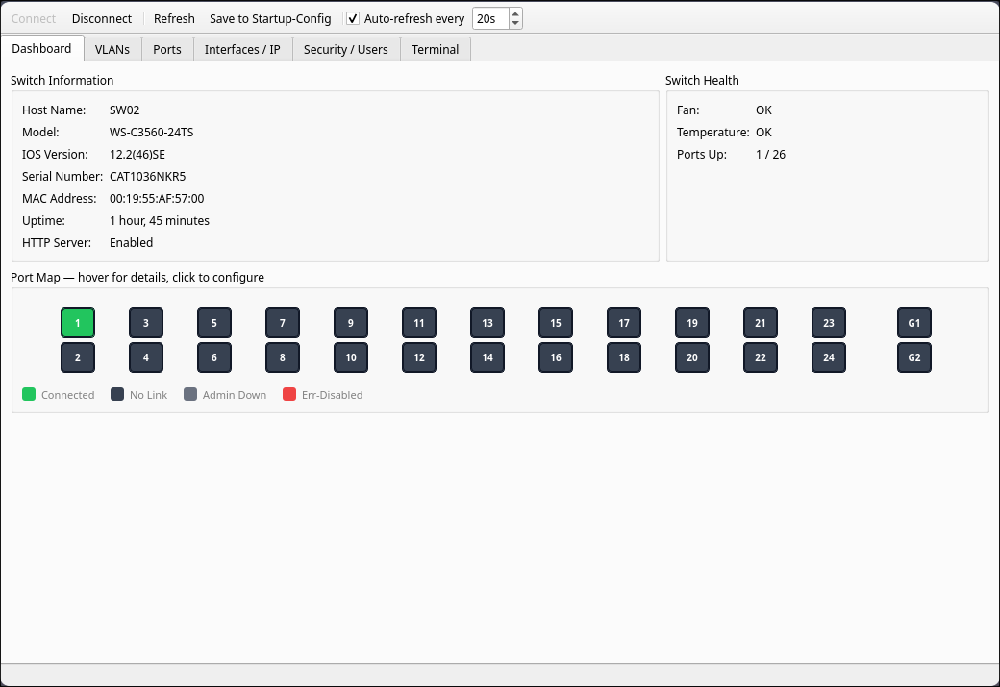
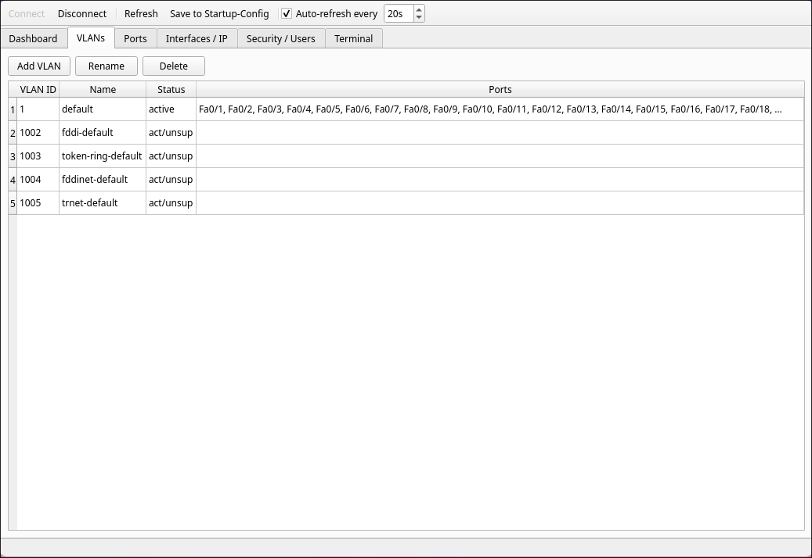
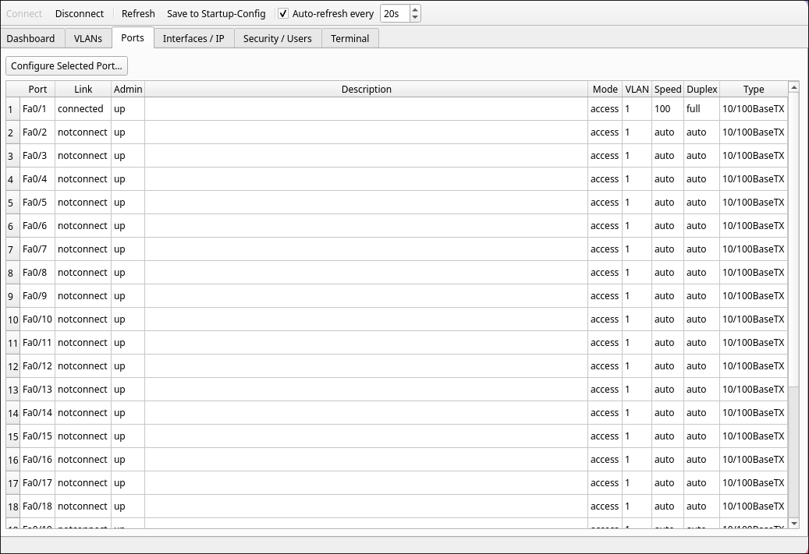
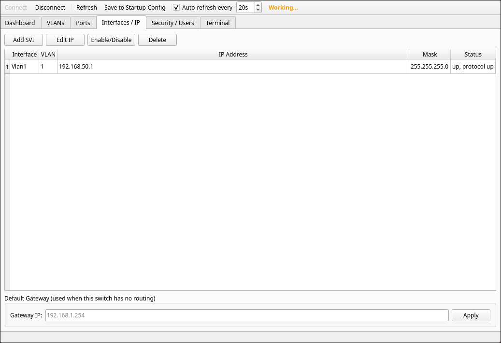
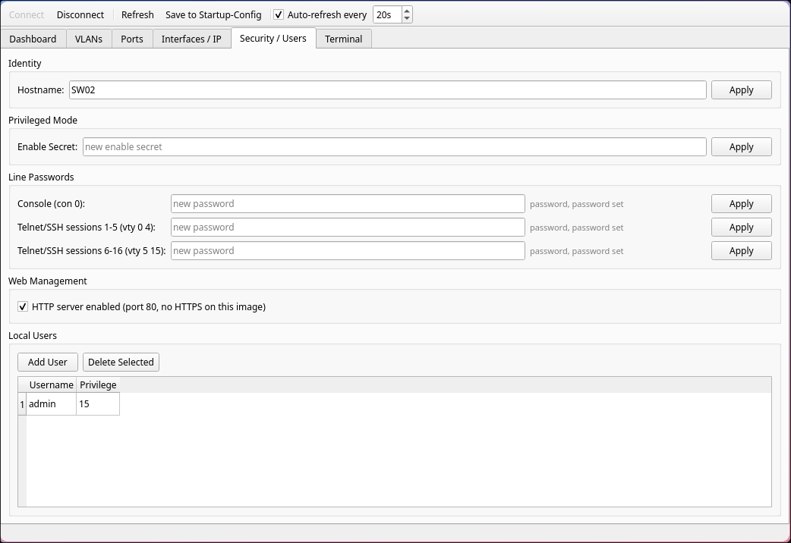
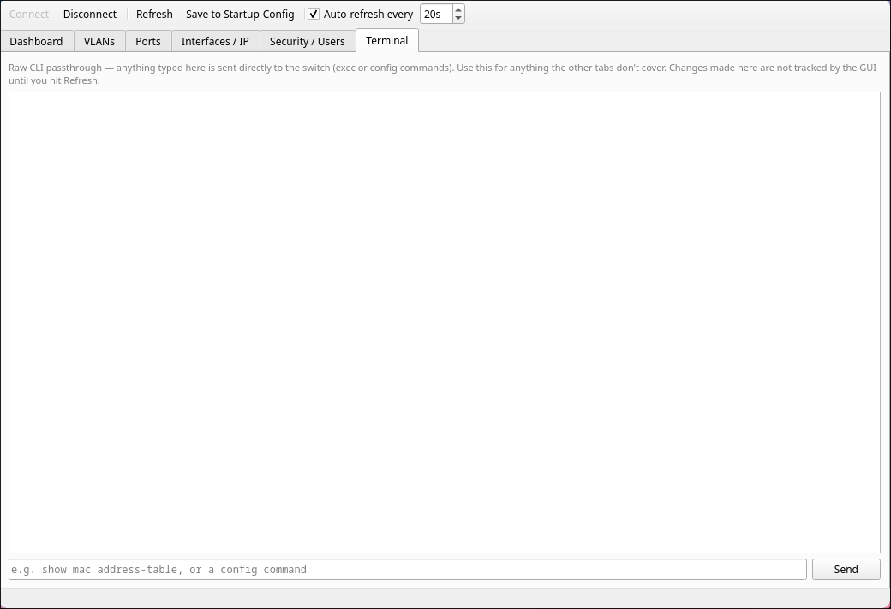
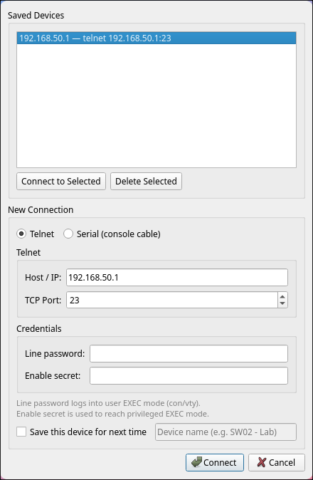

# Cisco Catalyst 3560 GUI

A desktop GUI for managing a Catalyst 3560 switch over Telnet or a serial
console cable, built because the switch's own embedded web Device Manager
can't create VLANs - only Cisco Network Assistant could, and that's an
abandoned Java app from a decade+ ago.

This talks to the switch the same way you would by hand: it drives the IOS
CLI over Netmiko and screen-scrapes `show` command output. There is no API
on this thing - IOS 12.2(46)SE on the IP Base image doesn't have one.

## What it does

- **Dashboard** - live front-panel port map (24x FastEthernet + 2x Gigabit),
  color-coded by link/admin state, switch identity, fan/temp health
- **VLANs** - create, rename, delete
- **Ports** - description, admin up/down, access/trunk mode, VLAN
  assignment, speed/duplex
- **Interfaces / IP** - SVI (`interface Vlan X`) management, default gateway
- **Security / Users** - hostname, enable secret, console/VTY line
  passwords, local user accounts, HTTP server toggle
- **Terminal** - raw CLI passthrough for anything the other tabs don't cover
- **Saved devices** - remember a connection (host/serial + credentials) so
  you can reconnect in one click instead of retyping everything

Auto-refreshes on a timer (default 20s, adjustable) and after every action,
so the GUI never drifts out of sync with what's actually on the switch.

## Screenshots

**Dashboard**


**VLANs**


**Ports**


**Interfaces / IP**


**Security / Users**


**Terminal**


**Connection dialog - saved devices**


## Requirements

- [uv](https://docs.astral.sh/uv/)
- A Catalyst 3560 (or close IOS relative) reachable over Telnet, or a
  USB-to-serial console cable

```
uv sync
```

## Setting up a factory-fresh switch

The GUI drives an existing config over Telnet or serial - it can't bring a
switch onto the network for the first time, since that needs an IP address
and a password to already exist. If you're starting from a switch with no
config (or an unknown password inherited from wherever you got it), do
this once via console cable first:

1. **Find the console adapter** and connect at 9600 baud, 8N1:
   ```
   dmesg | grep -i tty          # confirms the port, usually /dev/ttyUSB0
   sudo usermod -aG uucp $USER  # if you get a permissions error (relog after)
   picocom -b 9600 /dev/ttyUSB0
   ```

2. **Unknown password?** Power off, hold the switch's `Mode` button, power
   back on, keep holding until the SYST LED goes solid green. At the
   `switch:` boot-loader prompt:
   ```
   flash_init
   rename flash:config.text flash:config.text.old
   boot
   ```
   Answer "no" to the setup dialog, then `enable` gets you into privileged
   mode with no password. Merge the old config back in if you want to keep
   it (`rename flash:config.text.old flash:config.text` then
   `copy flash:config.text running-config`), or skip that and configure it
   clean from here.

3. **Minimum config so the GUI can reach it:**
   ```
   enable
   configure terminal
   hostname SW01
   enable secret YOUR_PASSWORD
   line con 0
    password YOUR_PASSWORD
    login
   line vty 0 4
    password YOUR_PASSWORD
    login
   line vty 5 15
    password YOUR_PASSWORD
    login
   interface vlan 1
    ip address 192.168.50.1 255.255.255.0
    no shutdown
   ip http server
   end
   copy running-config startup-config
   ```

4. **Give your Linux machine an IP on that subnet** so it can actually
   reach the switch. Plug into any access port, then:
   ```
   ip -br addr                                  # find your interface name
   sudo ip addr add 192.168.50.2/24 dev <iface>
   ping 192.168.50.1
   ```
   That address is temporary - gone on reboot or unplug, which is fine for
   a one-off setup session. Make it persistent with your distro's network
   manager (`nmcli`, `netplan`, etc.) if you want it to survive a reboot.

5. Launch the GUI and connect over Telnet to `192.168.50.1` - everything
   past this point (VLANs, ports, further IP config) is easier through the
   GUI than the CLI.

## Running it

```
uv run python main.py
```

You'll get a connection dialog on launch - pick Telnet or Serial, enter the
line password and enable secret, and it connects. Check "Save this device
for next time" to remember it; next launch, the dialog opens with your
saved devices listed above the connection form, one click to reconnect.

Saved devices (including passwords, by design - see below) live in
`~/.config/cisco3560-gui/devices.json`, chmod'd `0600`. That file is local
only; it's never part of this repo and nothing here should ever commit it.
If you'd rather not have credentials on disk at all, just leave "Save this
device" unchecked and type them in each time.

## Why Telnet and not SSH

This switch runs the non-crypto (`IPBASE`, not `IPBASEK9`) image, which
doesn't support SSH or HTTPS at all - `ssh` isn't even a recognized keyword
for `transport input`. If your switch has a crypto-capable image, Netmiko
supports SSH fine, it's just not wired up here since it wasn't usable
against the hardware this was built for.

## Architecture

- `core/device.py` - thin synchronous wrapper around Netmiko. All the
  blocking I/O lives here.
- `core/parsers.py` - regex/fixed-width-column parsing of `show` command
  output into plain dataclasses (`core/models.py`). No TextFSM/genie
  dependency - the output format of this specific platform/IOS version is
  simple enough that hand-written parsing is more predictable.
- `core/worker.py` - a `QObject` that owns the `SwitchDevice` and runs on a
  dedicated `QThread`, so Netmiko's blocking calls never freeze the UI.
- `gui/` - one file per tab, plus `main_window.py` wiring it all together.

**Threading rule that matters if you touch this code:** every call from the
GUI into the worker, and every result signal back, has to go through a real
`Signal` connected to a *bound method of a QObject* - never a `lambda` or a
direct method call. Qt can only auto-detect that a connection crosses
threads (and route it through the target thread's event loop) by inspecting
the receiving `QObject`'s thread affinity. A lambda has no such object to
inspect, so it silently runs on the *emitting* thread instead - which for
worker→GUI signals means GUI code executing on the network thread. This
showed up during development as
`QBasicTimer::start: Timers cannot be started from another thread` and
would freeze the UI on GUI→worker calls. See `gui/main_window.py` for the
pattern (`request_save_config` etc.).

## Known limitations

- No HTTPS/SSH (see above - hardware/image limitation, not a GUI limitation)
- No trunk allowed-VLAN diffing - setting trunk config always re-sends the
  full allowed-VLAN list rather than computing add/remove deltas
- No SNMP, no syslog, no config diffing/versioning - CLI-only, single
  switch at a time
